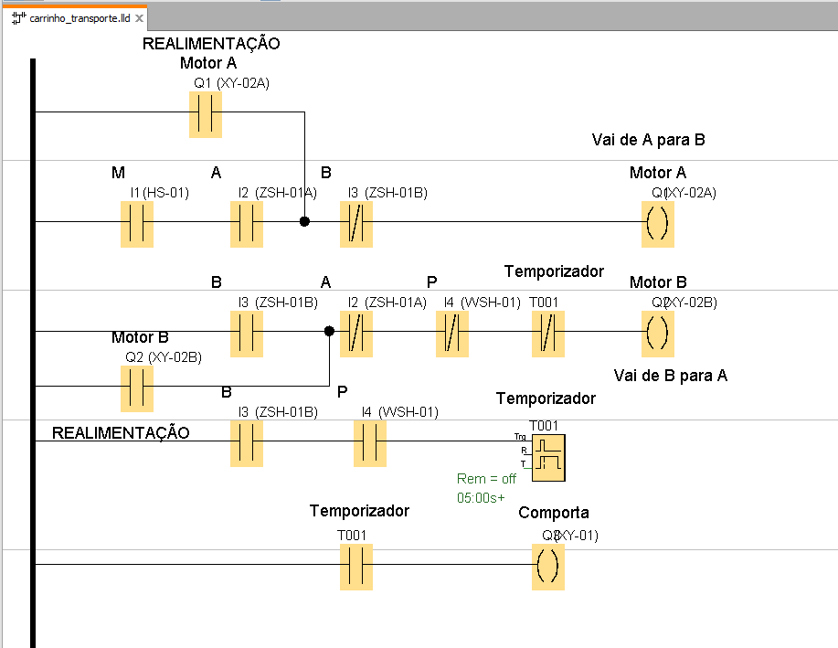
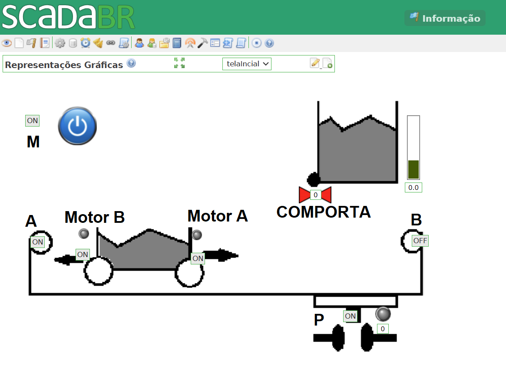
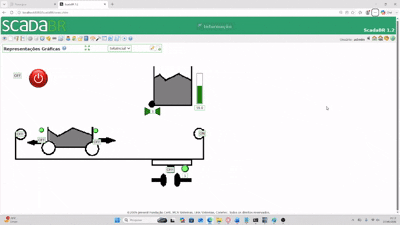

# 🚧 Projeto: Carrinho de Transporte (CLP / SCADA / Ladder)

Este projeto simula um sistema de automação industrial de um **carrinho de transporte automatizado**, desenvolvido com lógica Ladder em ambiente SCADA/CLP.

---

## 📌 Descrição do Processo

O sistema funciona conforme a seguinte sequência operacional:

1. O carrinho inicia na posição de repouso à esquerda, com o sensor **"a" acionado**.
2. O processo é iniciado ao pressionar a botoeira **"m"**.
3. O carrinho se desloca para a direita até acionar o sensor **"b"**.
4. Ao atingir o sensor **"b"**, a comporta **"carrega" é aberta** e o material é carregado.
5. Quando o sensor **"p"** é acionado, indica que o peso correto foi atingido.
6. Neste momento, a comporta **"carrega" é fechada**.
7. O sistema aguarda **5 segundos** após o fechamento da comporta.
8. O carrinho retorna para a esquerda até acionar novamente o sensor **"a"**.
9. O ciclo é finalizado.

---

## ⚙️ Objetivo

Implementar um **diagrama Ladder de controle** capaz de automatizar completamente o ciclo descrito, garantindo:

- Sequenciamento correto das etapas
- Intertravamento de sensores e atuadores
- Temporização de 5 segundos no retorno
- Controle seguro do movimento bidirecional do carrinho

---

## 🧠 Lógica de Controle (Resumo)

O sistema pode ser entendido como uma máquina de estados simples:

- Estado inicial: repouso (sensor A)
- Movimento → direita (até sensor B)
- Carregamento (sensor B + peso P)
- Fechamento da comporta
- Temporização (TOF 5s)
- Retorno → esquerda (até sensor A)

---

## 🧠 Lógica Ladder (Diagrama de Controle)

A implementação abaixo foi desenvolvida no LOGO! Soft Comfort e é responsável por controlar toda a sequência do carrinho de transporte.

## 🖥️ Interface SCADA

---

## 📊 Simulação do Processo

---

## 📎 Atividade Proposta

A atividade solicitada foi:

> Desenvolver um diagrama Ladder de controle para um carrinho de transporte automatizado seguindo a sequência descrita acima.

---

## 🗂️ Observações

- O sistema foi implementado considerando sensores discretos (A, B e P)
- A temporização de 5 segundos foi realizada via bloco de temporizador (TOF)
- A lógica garante reinício automático do ciclo ao retornar ao estado inicial

